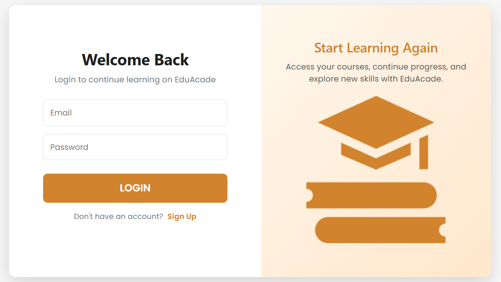
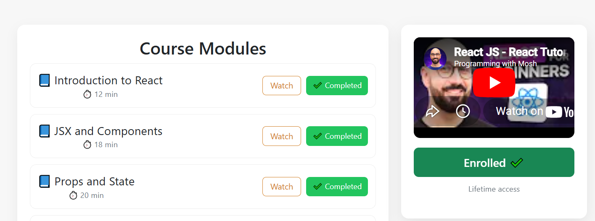
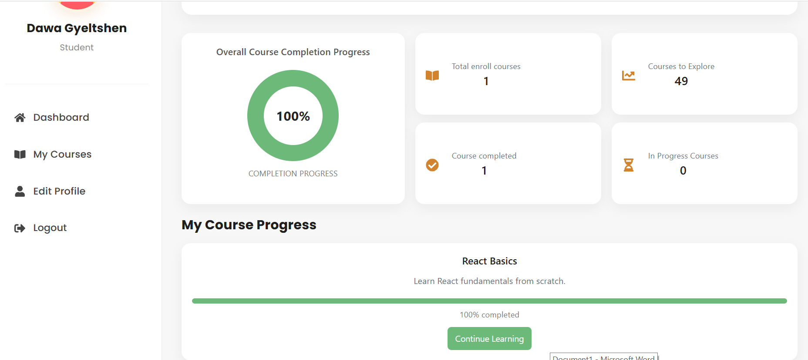
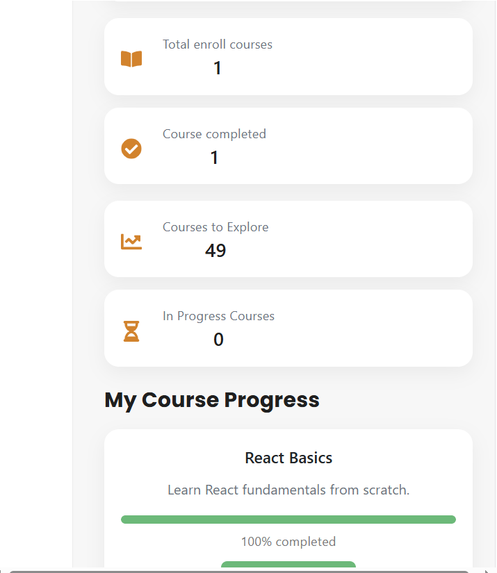
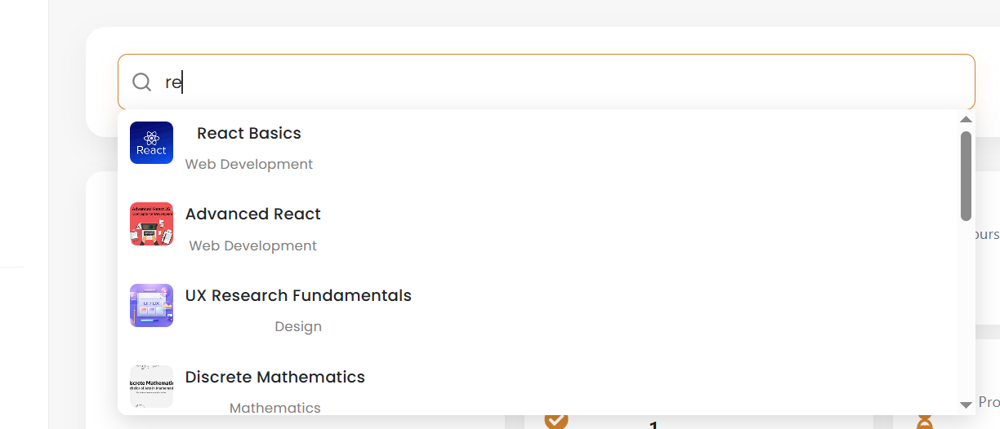

### Project Title: EduAcad- An Online Educational Learning Platform

Prject Overview
EduAcad is a modern online education Learning platfrm inspired from Udemy and Coursera built using React+Vite.
It allows users to browse courses, enroll in them, track learning progress, complete modules, and manage their profile.

The system simulates a real-world e-learning platfrom such as Udemy and Coursera. It has following features:
- Course browsing and enrollment
- Module-based video learning
- Progress tracking system
- User profile management
- Search functionality
- Dashboard analytics

# Technology Stack
- Frontend: React.js
- Routing: React Router DOM
- Styling: CSS modules + Bootstrap
- Icons: React Icons
- Data Storage: JSON file for storing courses, modules and inital signed in users. LocalStorage for mock backend.

# Installation instructions
1. Clone the repository from GitHub using given command. Make sure you have git installed on your computer.

git clone https://github.com/dgyel1993-arch/EduAcad.git

2. Navigate tor project folder using given command

cd eduacad

3. install dependencies. You also need latest Node.js installed.

npm install

4. Start development server (Vite server)

npm run dev

5. Open the browser enter the given link

http://localhost:5173

# Key Features
1. Course Catalog:
For demonstration purposes, 50 courses are stored in a JSON file. Users can browse and search for any course they are interested in learning. 

2. User Authentication:

Guest users can view courses but cannot enroll or track progress.
To access full functionality, users must:
- Sign up first
- Log in to the system
User authentication is implemented using localStorage for persistence.

3. Course Enrollment
Once logged in, users can enroll in courses. Each course contains multiple modules, and users can:
- Preview first module video lecture
- Watch video lectures
- Mark modules as completed once studied

4. Progress Tracking:
User progress is automatically calculated based on completed modules.
- Each course shows individual progress
- Overall learning progress is also tracked
- Helps users understand their learning journey clearly
This is desktop view vs mobile view of the user dashboard:
 
5. Search functionality:
User can search for courses.

6. Profile Management:
User can also update their profile.

# Design decisions
1. Vite for performance: Vite was chosen for fast development server. 
2. LocalStorage: Chosen to simplify development and focus on frontend logic with backend simulation.
3. React  (Component based): The app is split into reusable modules:
    - Dashboard: Contains reusable components used to user dashboard.
    - Courses: Contains components related to courses
    - Auth: Contains components related to user authentication.
    - Header and Sidebar are made into reusable components.
    - Styles: All CSS styles are stored in this folder.

